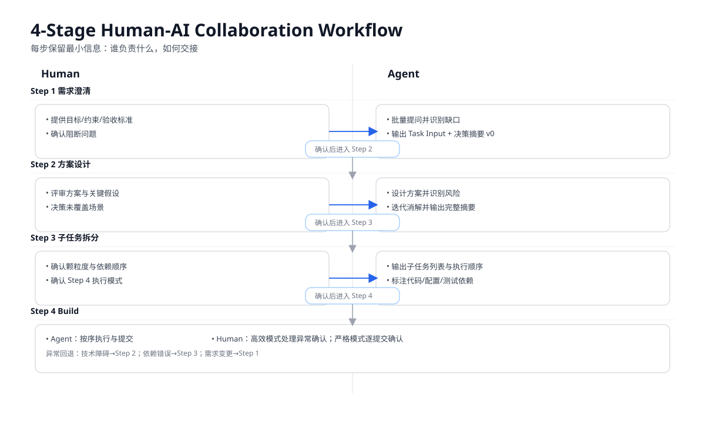

# Human-AI Collaborative Programming Workflow

## 目录

- [概述](#概述)
- [信息格式规范](#信息格式规范)
- [工作流步骤](#工作流步骤)
- [第一步：需求澄清](#第一步需求澄清)
- [第二步：方案设计与风险消解](#第二步方案设计与风险消解)
- [第三步：子任务拆分](#第三步子任务拆分)
- [第四步：顺序或并行 Build 子任务](#第四步顺序或并行-build-子任务)
- [参考文献](#参考文献)

> 适用场景：AI Agent 在 Human-in-the-loop 模式下处理单个编程任务单

---

## 概述

本工作流定义了人类与 AI Agent 协作完成一个编程任务单的完整过程。其核心设计原则是：

- **逐步缩小不确定性**：每一步都在前一步的基础上消解歧义，把风险前置处理
- **决策全程可追溯**：`AI 决策摘要` 作为贯穿全流程的共享状态，最终沉淀进任务文档、证据包与人工提交说明
- **人工介入点明确**：每步结束时有清晰的人工确认节点，确认内容各有侧重，避免泛化的"看一遍"

本工作流的设计思路源于 Human-in-the-Loop（HITL）软件工程研究的核心洞察：在 AI Agent 自主执行的每个关键阶段保留人类审查与引导能力，能够在减少开发时间的同时维持代码质量 \[1\]。研究表明，完全自主的 LLM Agent 在真实 GitHub 问题上的解决率仍然有限 \[2\]，这意味着人机协作而非全自动化是当前阶段更实际的工程选择。



> 图示说明：以双泳道方式展示四阶段中 Human 与 Agent 的主要职责、交接确认点，以及异常回退关系。

---

## 信息格式规范

### 语言选择规则

- 人类可读内容默认跟随当前任务中的主导交互语言。
- 若多语言混用且无明显主导语言，默认使用英文。
- 若人类明确指定输出语言，以人类指令为最高优先级。

> 该规则适用于对话文本、报告与总结等人类可读部分；不强制影响代码标识符、路径或命令字面量。

### 任务输入格式

```markdown
## 任务输入
- 需求描述：
        - 目标：
        - 功能要求：
        - 非功能属性：
        - 约束条件：
        - 验收标准：
        - 范围影响（模块 / 服务 / 数据）：
```

### AI 决策摘要格式

```markdown
## AI 决策摘要
- 需求理解：[AI 对任务的理解描述]
- 采用方案：[选择的实现方式及原因]
- 拒绝方案：[考虑过但未采用的方案及原因]
- 关键假设：[AI 做出的前提假设]
- 已知风险：[AI 自识别的潜在问题，格式见下]
- 未覆盖场景：[AI 明确标注需人工确认的部分]
```

**已知风险条目格式**（每条风险须包含三要素）：

```
- [风险名称]：触发条件 → 后果描述。消解方式：[方案调整 / 增加约束 / 标注为未覆盖场景]
```

示例（有效）：
```
- 分页缺失：getUserList() 在数据量 >10k 时无分页，会触发数据库超时。消解方式：改为游标分页，每页限 100 条。
```

示例（无效，走形式）：
```
- 可能存在性能问题。
```

### 子任务标题格式

遵循 Conventional Commits 规范 \[3\]，并加 `[AI]` 前缀标识由 Agent 生成：

```
[AI] <type>(<scope>): <subject>
```

**type 参考值**：`feat` / `fix` / `refactor` / `test` / `chore` / `docs` / `perf` / `ci`

### 统一证据包格式

为避免信息散落在多个位置，推荐在每一步输出中维护同一份证据字段，并在第四步提交前校验完整性：

```markdown
## 证据包
- 需求证据：[可测试验收标准、范围影响]
- 设计证据：[采用/放弃方案与原因]
- 风险证据：[已知风险及消解动作]
- 测试证据：[Red -> Green -> Refactor 记录]
- 决策证据：[未覆盖场景与决策归属]
- 能力执行证据（使用 superpowers 时）：[能力名称、能力来源路径、触发原因、关键发现、建议动作、采纳/不采纳及理由]
- Step 4 强制能力证据：[test-driven-development、verification-before-completion、systematic-debugging、requesting-code-review、receiving-code-review 的执行证据或 Not Triggered 证据]
- Step 4 子任务交接证据：[已完成子任务数、变更摘要、测试结果、门禁结果、人工验收关注点]
- Step 4 完成提示证据：[固定完成提示语文本、输出时间戳]
```

**Evidence Gate 触发点（必须执行）**：

| 触发阶段 | 模式 | 执行时机 |
|----------|------|----------|
| Step 1 → Step 2 | 不区分模式 | 人类确认 Step 1 后、开始 Step 2 前 |
| Step 2 → Step 3 | 不区分模式 | 人类确认 Step 2 后、开始 Step 3 前 |
| Step 3 → Step 4 | 不区分模式 | 人类确认 Step 3 后、开始 Step 4 前 |
| Step 4（每个子任务交接前） | 不区分模式 | 每个子任务完成实现与验证后、进入人工验收交接前 |
| Step 4（最终门禁） | 不区分模式 | 全部子任务完成后、输出固定完成提示语前 |

> Step 1-3 的测试证据可标注 `N/A`；Step 4 需有执行证据。文档类/格式类子任务可使用 `TDD Evidence: N/A`，但必须给出理由与最小回归检查结果。
> 若已使用 superpowers 但缺失能力执行证据，或能力来源路径不在 `.github/skills/superpowers/` 下，Evidence Gate 必须阻断流转。
> Step 4 不区分提交模式；AI 负责实现、验证与验收交接，`git commit` 由人工在验收后执行。

---

## 工作流步骤

### 第一步：需求澄清

**目标**：Agent 与人类充分交互，直到完全理解需求，并以标准格式输出，等待人类确认。

**阻断规则（开始前）**：当请求属于编程任务时，必须先完成 Step 1 并等待确认；在 Step 1 确认前，不读取业务代码、不改代码、不运行构建/测试命令。

#### Agent 行为准则

**追问 vs 假设的判断原则**：核心是比较两种成本——追问的摩擦成本 vs 假设错误的纠偏成本。研究表明，需求歧义是 LLM 辅助软件开发中最常见的失败来源之一，系统性的需求澄清能够显著提升 AI 生成代码与预期之间的对齐度 \[4\]\[5\]。

| 情况 | 处理方式 |
|------|----------|
| 信息缺失会影响整体目标方向 | **必须追问**，阻断流程，等待回答 |
| 有行业惯例或通用最佳实践可参照 | **假设并标注**，写入"关键假设" |
| 纠偏成本高（如涉及架构、数据结构） | **追问**，说明为何需要确认 |
| 纠偏成本低（如命名风格、日志级别） | **假设并标注**，写入"关键假设" |

**追问的执行规则**：

1. **批量提问**：一次列出所有需要确认的问题，不逐条来回
2. **给出默认选项**：每个问题附上 Agent 倾向的答案，人类只需确认或纠正
3. **区分阻断与非阻断**：明确标注哪些问题是"必须回答才能继续"，哪些是"不回答我将按默认推进"
4. **阻断问题上限**：阻断问题单轮最多 3 个，超过 3 个说明需求过于模糊，应先请求补充上下文

**可测试性最小清单（建议在第一步完成）**：

- 至少 1 条主流程验收标准
- 至少 1 条异常/边界验收标准
- 明确范围影响（模块、接口、数据或配置）
- 明确不在本次范围内的事项

**提问模板**：

```markdown
**必须确认（阻断）：**
以下信息缺失会影响整体方向，请确认后我才能继续：
1. [问题 A]——我的理解是 X，是否正确？
2. [问题 B]——默认按 Y 处理，如有不同请说明。

**假设并标注（不阻断）：**
以下我将自行假设，已写入"关键假设"，如有异议请在确认时指出：
- 假设 P：……
- 假设 Q：……
```

#### 步骤结束输出

Agent 输出以下内容，**等待人类确认**：

```markdown
## 任务输入
- 需求描述：…

## AI 决策摘要
- 需求理解：…

[HACA Step 1/4: Requirement Clarification] - Wait for your confirmation before moving to the next step
```

> **人工确认要点**：核对 Agent 的需求理解是否准确，验收标准是否可测试。  
> 人类可提出修订，Agent 持续更新输出，直到人类明确确认。

---

### 第二步：方案设计与风险消解

**目标**：Agent 在理解需求的基础上提出解决方案，识别并消解已知风险，输出完整的 AI 决策摘要，等待人类确认。

#### 风险识别的五个维度

Agent 必须从以下维度系统检查，每条风险须具体到当前任务上下文，不接受泛化描述。Atlassian 的 HULA 工业实践研究指出，代码功能性仍是 AI 辅助开发中的主要质量挑战，这要求在执行前对方案做充分的风险识别 \[1\]\[6\]：

| 维度 | 检查内容 |
|------|----------|
| **逻辑边界** | 边界值、空值、并发竞态、异常路径 |
| **依赖耦合** | 外部 API 变更、版本兼容性、隐式耦合 |
| **数据完整性** | 不可逆操作、迁移一致性、事务边界 |
| **安全** | 注入风险、权限越界、敏感数据暴露 |
| **影响范围** | 回归影响、隐性调用方、共享状态修改 |

#### 风险消解迭代循环

```
识别风险 → 调整方案消解 → 重新检查 → 仍有风险？
                ↑_____________↓（< 10 次）
                          ↓（已无风险 或 达到阈值）
                    输出 AI 决策摘要
```

- **消解方式**：修改方案结构、增加技术约束、缩小影响范围
- **达到阈值（10次）**：未消解的风险降级为"未覆盖场景"，显式标注人工决策点
- **已知风险 vs 未覆盖场景的区别**：
  - 已知风险：Agent 识别到，并在方案层面做出了调整
  - 未覆盖场景：Agent 识别到，但无法在当前信息和能力范围内消解，需要人类决策

#### 步骤结束输出

Agent 输出完整的 AI 决策摘要，**等待人类确认**：

```markdown
## AI 决策摘要
- 需求理解：…
- 采用方案：…
- 拒绝方案：…
- 关键假设：…
- 已知风险：…
- 未覆盖场景：…

[HACA Step 2/4: Solution Design] - Wait for your confirmation before moving to the next step
```

> **人工确认要点**：方案是否合理，拒绝方案是否有遗漏，未覆盖场景如何决策。  
> 人类可提出修订或补充约束，Agent 持续更新摘要，直到人类明确确认。

---

### 第三步：子任务拆分

**目标**：将确认后的需求按"适合 Code Review 的颗粒度"拆分为多个子任务，输出完整的子任务列表等待人类确认。

#### 颗粒度判断标准

一个子任务颗粒度合适，当且仅当同时满足以下三个条件。人类 reviewer 的认知负担研究建议单次代码审查的变更范围应保持在可在有限时间内完整理解的粒度 \[7\]：

1. **单一意图**：子任务意图能用一句话说清楚，不需要用"以及"连接两件事
2. **自包含可验证**：该子任务完成后，代码库仍处于可构建、可测试的状态
3. **认知负担可控**：一个 reviewer 能在 15 分钟内完整理解这次变更

任一条件不满足 → 继续拆分或合并，直到三个条件同时满足。

#### 常见拆分原则

- **`refactor` 与 `feat` 必须分离**：先拆出结构重构（不改行为），再拆出功能实现。混合在同一子任务中会让 reviewer 无法判断行为变化是有意为之还是重构副作用
- **数据库迁移必须独立且排在最前**：迁移脚本需单独确认可回滚性和数据风险
- **`test` 的处理**：测试代码量少时可与实现同 commit；测试基础设施复杂时单独提交
- **配置变更先于使用它的代码**：env、feature flag 等配置变更单独提交，排在依赖它的业务代码之前

**TDD 导向拆分**：

- 测试基础设施任务优先于业务测试任务
- 业务测试任务优先于实现任务，以便形成可验证的 Red 起点
- 重构任务与功能任务分离，保证 Refactor 不混入行为变化

#### 依赖关系标注

第三步必须同时输出子任务的依赖关系，这是第四步的执行计划：

| 依赖类型 | 说明 |
|----------|------|
| **代码依赖** | T2 调用了 T1 新增的函数或接口 |
| **数据依赖** | Schema 迁移在前，业务代码在后 |
| **测试依赖** | 测试基础设施先于业务测试用例 |
| **配置依赖** | env / feature flag 先于使用它的代码 |

#### 步骤结束输出

每个子任务的完整描述，**等待人类确认**：

```markdown
## [AI] <type>(<scope>): <subject>

## 任务输入
- 需求描述：…

## AI 决策摘要
- 需求理解：…
- 采用方案：…
- 拒绝方案：…
- 关键假设：…
- 已知风险：…
- 未覆盖场景：…
```

同时附上执行顺序说明：

```markdown
## 执行顺序
- T1 → T2 → T3（严格顺序）
- T4 与 T5 可并行（无依赖关系）
- T6 依赖 T4 和 T5 均完成后执行

[HACA Step 3/4: Task Decomposition] - Wait for your confirmation before moving to the next step
```

> **人工确认要点**：拆分是否合理，颗粒度是否适合 Code Review，依赖顺序是否正确。  
> 人类可提出修订，Agent 持续调整，直到人类明确确认。

---

### 第四步：顺序或并行 Build 子任务

**目标**：按第三步确认的依赖顺序执行各子任务，形成可验收、可追溯的实现与证据交接；`git commit` 不属于 Agent 在 HACA 主流程中的动作。

#### 执行原则

- 严格按照第三步输出的执行顺序处理依赖关系
- 无依赖关系的子任务可并行执行
- 每个子任务完成后，必须通过自检（构建、测试、lint、类型检查）并输出验收交接信息
- Agent 不执行 `git commit`；人工在验收后决定是否以及何时提交

#### 最小门禁（Step 4）

子任务交接前至少完成以下检查：

- 已读取并执行 `.github/skills/evidence-gate/SKILL.md`
- 子任务编号与变更范围一致性校验通过
- 项目可用检查项通过（按仓库能力启用构建、测试、lint、类型检查）
- 已输出当前子任务的变更摘要、测试结果、已知风险与未覆盖场景

#### 每个子任务的执行循环

```
执行 build（编码 + 自测 + lint + 类型检查）
        ↓
整理当前子任务的变更摘要、验证结果与风险说明
        ↓
执行 Evidence Gate
        ↓
通过后进入人工验收交接
        ↓
继续下一个子任务
```

#### Step 4 强制质量控制顺序（HACA + superpowers）

每个子任务执行必须覆盖以下质量控制链路；缺失任一证据即阻断子任务完成（或提供 `Not Triggered` 证据 / 显式批准例外）：

1. `test-driven-development`：执行 Red-Green-Refactor，或在文档/非行为变更场景记录 `TDD Evidence: N/A` 与理由
2. `verification-before-completion`：提供本次变更的最新验证证据（命令、关键输出、退出码）
3. `systematic-debugging`：出现失败/异常时必须执行根因排查；若未触发失败，记录 `Not Triggered`
4. `requesting-code-review` 与 `receiving-code-review`：执行审查请求与反馈处理闭环，并记录结论
5. Evidence Gate：校验当前子任务证据完整性，通过后才可进入人工验收交接

#### TDD 执行闭环

第四步建议按 Red-Green-Refactor 三段循环执行每个子任务：

1. **Red**：先新增/调整测试并观察失败，记录失败原因
2. **Green**：以最小实现让测试通过
3. **Refactor**：在测试全绿前提下优化结构，不改变外部行为

**最小 TDD 证据门禁**：

- 有失败测试记录（Red）
- 有通过记录（Green）
- 有重构说明或明确标注“本次无需重构”（Refactor）

**可选场景（允许 `TDD Evidence: N/A`）**：

- 子任务仅为文档或纯格式变更
- 不涉及运行时行为、API 合约、数据结构或权限模型变化
- 补充最小回归检查结果（如结构校验、链接/格式校验）

> **人工确认要点**：第四步中人工关注的是子任务是否达到验收条件，以及是否允许在验收后由人工执行提交。代码逻辑已在第二、三步充分确认；第四步的核心是完成实现、验证与交接。

#### 意外情况处理

执行过程中遇到意外时，**回退到对应步骤**，而不是在第四步原地修补：

| 意外类型 | 处理方式 |
|----------|----------|
| 遇到第三步未预料的技术障碍 | 停止当前子任务，回退到**第二步**重新做风险识别和方案调整 |
| 发现依赖顺序有误 | 暂停执行，回退到**第三步**重新排列子任务顺序 |
| 需求在执行中发生变更 | 回退到**第一步**重新澄清需求 |

> 回退不是失败，是信号。停止比硬撑更有价值，从断点处重新规划即可。

#### Step 4 完成后的固定收尾门禁

全部子任务完成后，必须执行 final Evidence Gate。仅当最终门禁通过时，才允许输出固定提示语：`All subtasks are complete, pending human verification before human-led git commit.`。

输出该提示语后，Agent 必须等待人类后续指令，不得自动推进到集成动作。

---


## 参考文献

\[1\] Takerngsaksiri, W., Pasuksmit, J., Thongtanunam, P., Tantithamthavorn, C., Zhang, R., Jiang, F., Li, J., Cook, E., Chen, K., & Wu, M. (2025). **Human-In-the-Loop Software Development Agents**. In *Proceedings of the International Conference on Software Engineering (ICSE 2025)*. arXiv:2411.12924.  
→ 本文是 Atlassian 与 Monash 大学、墨尔本大学合作完成的工业研究，介绍了 HULA 框架在工单工作流中的部署实践，是本工作流"HITL 分阶段确认"设计的核心参考。

\[2\] Jimenez, C. E., Yang, J., Wettig, A., Yao, S., Pei, K., Press, O., & Narasimhan, K. R. (2024). **SWE-bench: Can Language Models Resolve Real-World GitHub Issues?** In *The Twelfth International Conference on Learning Representations (ICLR 2024)*. arXiv:2310.06770.  
→ SWE-bench 是评估 LLM 自主解决真实 GitHub 问题能力的标准基准，其结果揭示了当前 AI Agent 自主编程的能力边界，支持了本工作流采用人机协作而非全自动化的核心论据。

\[3\] Conventional Commits Community. (2019). **Conventional Commits Specification v1.0.0**. https://www.conventionalcommits.org/en/v1.0.0/  
→ 本工作流子任务标题格式与 commit message 结构直接遵循此规范。该规范定义了 `<type>(<scope>): <subject>` 的提交信息格式，使变更历史对人类和自动化工具均可读。

\[4\] Belzner, L., Schmid, T., & Wirsing, M. (2023). **Large Language Model Assisted Software Engineering: Prospects, Challenges, and a Case Study**. In *AISoLA 2023, LNCS vol. 14380*. Springer.  
→ 该研究通过 LLM 辅助软件工程的案例研究指出，需求描述中的歧义是导致生成产出与预期偏差的核心原因，支持了本工作流第一步系统性需求澄清的设计必要性。

\[5\] Ozkaya, I., et al. (2025). **Research Directions for Using LLM in Software Requirement Engineering: A Systematic Review**. *Frontiers in Computer Science*. https://doi.org/10.3389/fcomp.2025.1519437  
→ 该综述系统梳理了 LLM 在需求工程中的应用，证实了人机结合的混合方法能够提升需求生成的可靠性与准确性，为本工作流第一步的提问策略设计提供了理论依据。

\[6\] Pasuksmit, J., Takerngsaksiri, W., Thongtanunam, P., Tantithamthavorn, C., Zhang, R., Jiang, F., Li, J., Cook, E., Chen, K., & Wu, M. (2025). **Human-In-The-Loop Software Development Agents: Challenges and Future Directions**. arXiv:2506.11009.  
→ 作为 \[1\] 的后续研究，该论文分析了 HULA 工业部署中遇到的核心挑战，包括代码质量评估的高计算成本和 LLM 评估的不稳定性，支持了本工作流第二步风险识别迭代设计的必要性。

\[7\] Johnson, B., & Menzies, T. (2024). **Effective Software Engineering Requires Active Human Decision-Making**. Referenced in: Natarajan, S. et al. (2024). Human-in-the-loop or AI-in-the-loop? *arXiv:2412.14232*.  
→ 该研究强调了在软件工程过程中保持人类主动决策的重要性，指出将部分定义明确的子任务自动化（如静态分析）能够降低认知负担同时维持软件质量，是本工作流第三步颗粒度设计和第四步确认机制的实证基础。
